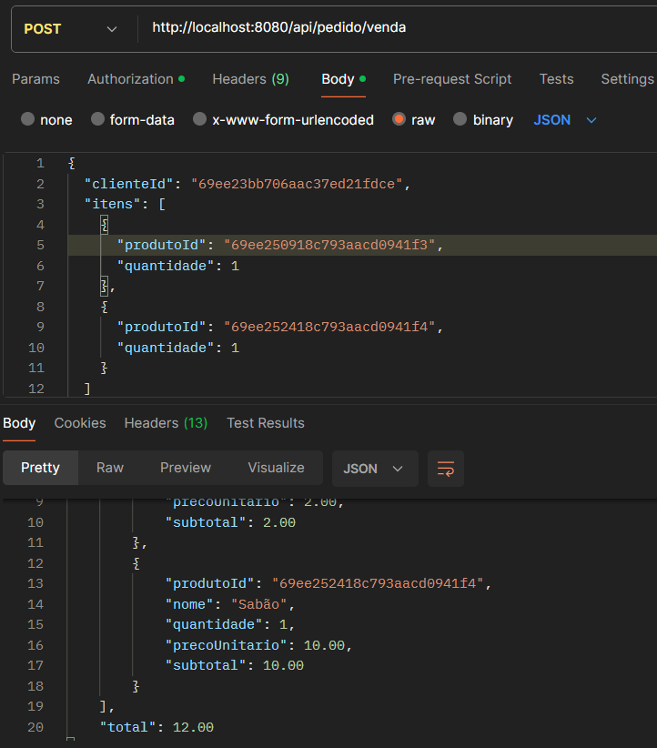
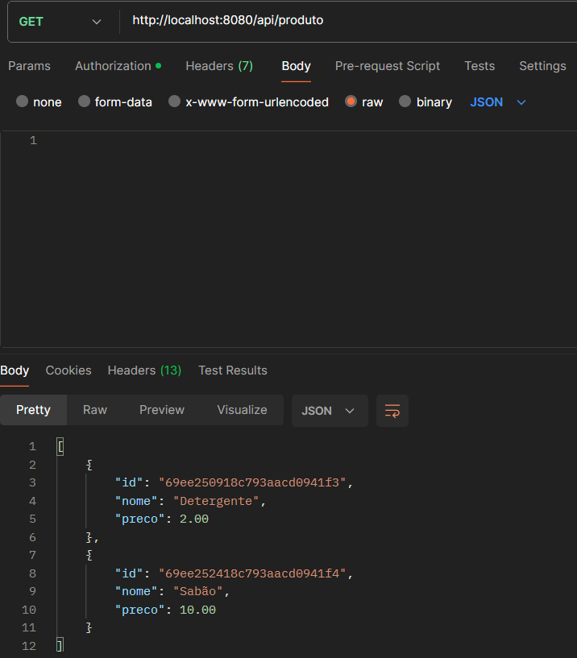

# 📦 Produto & Order Service

Este microsserviço é o núcleo da aplicação. Ele gerencia o catálogo de produtos e orquestra o processo de venda.

## 🔄 Integração (Feign Client)
Para realizar uma venda, este serviço utiliza o **Spring Cloud OpenFeign** para consultar de forma síncrona se o `clienteId` informado é válido no microsserviço de Clientes.

## 💰 Fluxo de Negócio
1. Recebe o pedido via POST.
2. Valida cliente via Feign.
3. Busca preços e estoque dos produtos.
4. Calcula subtotal e total da venda.
5. Persiste o registro final no MongoDB.

## 📸 Resultado Final (Integração Total)
Demonstração da venda processada com sucesso, totalizando R$ 12,00:

